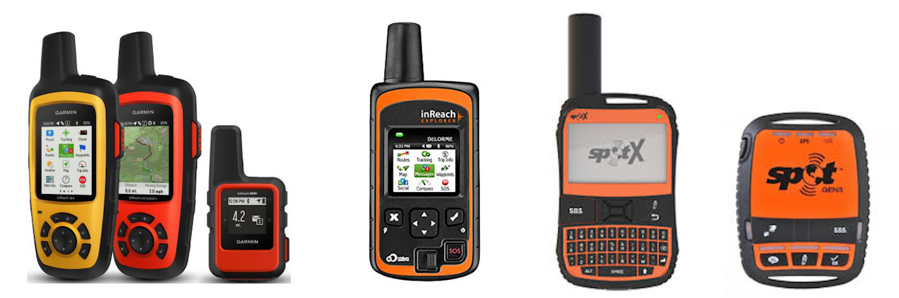

# TrackPilots.com API (Node.js)

# Why build this application?
When I was 16, my father & I learned how to fly powered paragliders. We saw a video on youtube of these guys flying around Dubai with parachutes and big fans attached to their backs. They were part of a flying team known as the Parabatix Sky Racers. (https://www.youtube.com/watch?v=cTQvYxELaFI) I was completely blown away by what I was seeing. These guys were flying low through the Dubai dunes chasing motorcycles & landing on top of moving dune buggies. They were flying with hot air balloons, doing flips, spins, stalls,  spirals & barrel rolls. Things I never imagined a parachute could do. They made it look so simple and easy. They just unfolded a parachute, started up a 2-stroke motor with a prop on it and ran into the air. I've been hooked on the sport ever since.

I made the transition to "free-flight" paragliding a year after learning to paramotor. "Free-flight" refers to flying a paraglider without a motor. Just the parachute and a harness. Paragliding pilots use thermals (warm rising pockets of air) to go up. When the sun heats the ground, the air near it starts to rise and create clouds. Warm air rises and cold air sinks. Paragliding pilots can ride these warm rising pockets of air thousands of feet to the cloud base. Some pilots like to fly Cross-Country. This is where they try to fly as far as they possibly can using nothing but thermals and the wind. Some flying hundreds of kilometers from where they started. This is where the need for a new application begins.

Cross-Country pilots are flying hundreds of kilometers out in the middle of nowhere over mountains, deserts, forests, etc. Where there is no cell service, there are no roads, and in some cases nowhere to even land. They have to use Personal Locator Beacons or Satellite Messengers to relay their positions via satellite to friends so they can get a ride back home. The two most popular brands being Garmin inReach and SPOT. These devices allow pilots to broadcast their position, send messages, and in some cases trigger an SOS. Each tracker has a website that you use to follow your friends and view the messages they send. Ex) (https://share.garmin.com/WilliamDavis2) But there is currently no way to track multiple people with dissimilar Satellite Trackers using one application. Also, there is no "Yellow pages" for tracking URLs. If you lose or misplace your friends tracking URL you are screwed.

I've been driving retrieve over the years for many of the Cross Country pilots in San Diego, Ca. I have noticed many things that can be streamlined using an application. First, let me walk you through a typical day. You typically start a groupchat using facebook or whatsapp and meet up at a park and ride, then carpool to the flying site. On the drive up you meet everyone, exchange contact information, talk about flying conditions, talk about where you want to fly to, what wing your flying, what radio frequency to use. And each pilot will send their unique tracking URL via text message or email to the retrieve driver.
The retrieve driver will then have to open up separate browser tabs to keep track of each pilot. There are typically 4 pilots which means 4 different google chrome tabs. And the retrieve driver will have to follow the pilots by car and pick them up wherever they land. This means the retrieve driver will have to keep looking through 4 different tabs to see who has landed and who is still flying meanwhile trying to navigate in a separate google maps tab. Keep in mind that reception is spotty or nonexistent in a lot of the places we fly.

# What are my goals for the project and what type of functionality should be expected?

# Supported Devices

  - [Garmin Inreach Satellite Trackers](https://explore.garmin.com/en-US/inreach/)
  - [Delorme Inreach Satellite Trackers](https://www.amazon.com/DeLorme-inReach-SE-Satellite-Tracker/dp/B00BX7TJ2O)
  - [SPOT Satellite Trackers](https://www.findmespot.com/en/)
  - iOS & Android (with cell reception) 

# Un-Supported Devices (Coming Soon)
 - [FlyMaster Flight Instruments](https://www.flymaster.net/)
 - [Yellow Brick Satellite Trackers](https://www.ybtracking.com/)
 - [FLARM](https://flarm.com/)
 - OGN/ICA

# App Structure
  
  A CloudWatch Rule triggers a lambda function every 5 minutes that goes out and grabs all of our users latest tracking data. This tracking data will be provided by companies like Garmin, SPOT, FlyMaster, etc. Each Satellite Messenger has its own unique URL that can pinged for raw tracking data. The lambda function will recieve the tracking data from the providers listed and save it to a MySQL Database in a single standardized format. This API will expose that tracking data and make tracking multiple pilots with disimilar devices simple and easy.