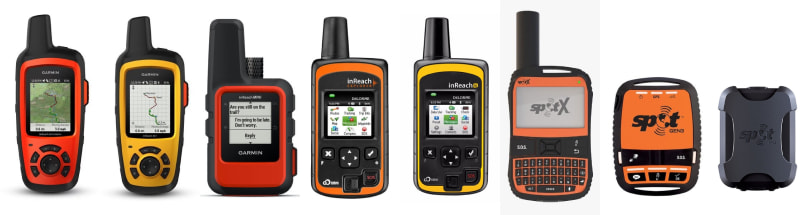
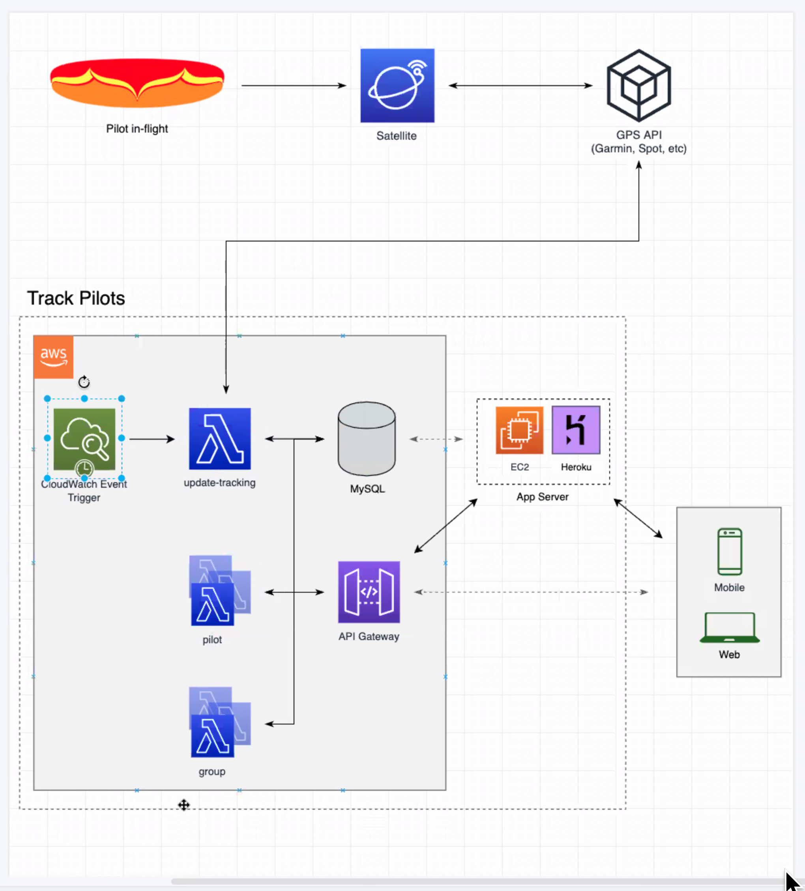

# TrackAny1.com
Track anyone, anywhere in the world, with the most popular and trusted Satellite Trackers.

[TrackAny1.com](https://trackany1.com)

[REST API Documentation](https://api.trackany1.com/docs)

# Why build this application?
At the moment there are only a few websites that allow you to live track groups of people using dissimilar satellite trackers. The few that do are outdated, lacking the most basic features with poor user experience.

Satellite trackers and messengers are commonly used by sailors, pilots, hikers, climbers, off-roaders, and many other outdoor types. They can be used to send SOS messages, text messages, relay your location, etc. They are valuable tools that allow you to stay safe & connected anywhere in the world. There are many brands. Garmin, DeLorme, Spot, FlyMaster, Yellow Brick, etc. Each brand has a live tracking website you can visit to track each device. This is where the problem lies.

When a person buys a new satellite tracker and activates it, they receive a public URL that can be shared with friends and family for live tracking. This works fine if you are only keeping tabs on one person at a time, but it quickly becomes an issue when you have a group of people you need to track. You would have to open separate browser tabs for each person and hop between them constantly refreshing and scrolling. 

TrackAny1.com is a web application that solves this issue. It allows you to track multiple people simultaneously anywhere in the world.

# What are my goals for the project and what type of functionality should be expected?
Sign in with Google and Facebook.
Users can register multiple Satellite Trackers and Messengers.
Users can create and join tracking groups.
Tracking groups are public, anyone can join or follow.
Users can follow other users. They will have a map with all of the people they are following. 
Tracking pages should allow user to see thier own location on the map using cellphones GPS.
Users can view and share their tracking logs.

# Supported Devices

  - [Garmin Inreach Satellite Trackers](https://explore.garmin.com/en-US/inreach/)
  - [Delorme Inreach Satellite Trackers](https://www.amazon.com/DeLorme-inReach-SE-Satellite-Tracker/dp/B00BX7TJ2O)
  - [SPOT Satellite Trackers](https://www.findmespot.com/en/) 

# Un-Supported Devices (Coming Soon)
 - [FlyMaster Flight Instruments](https://www.flymaster.net/)
 - [Yellow Brick Satellite Trackers](https://www.ybtracking.com/)
 - [FLARM](https://flarm.com/)
 - OGN/ICA

# App Structure
  
  A CloudWatch Rule triggers a lambda function every 5 minutes that goes out and grabs all of our users latest tracking data. This tracking data will be provided by companies like Garmin, SPOT, FlyMaster, etc. Each Satellite Messenger has its own unique URL that can pinged for raw tracking data. The lambda function will recieve the tracking data from the providers listed and save it to a MySQL Database in a single standardized format. This API will expose that tracking data and make tracking multiple users with disimilar devices simple and easy.